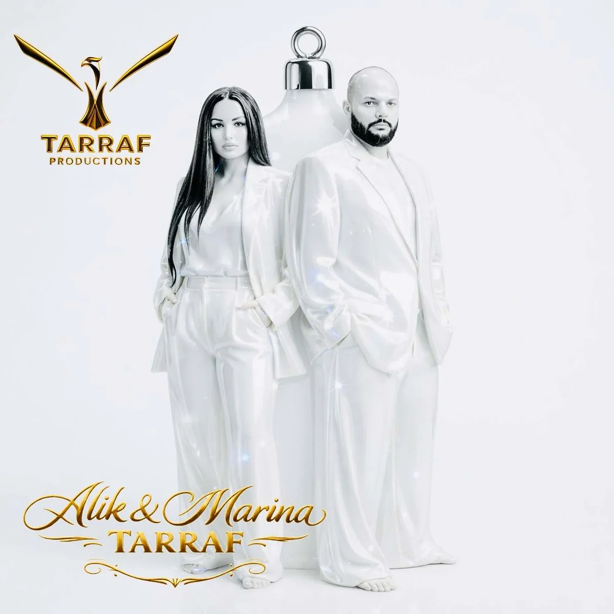
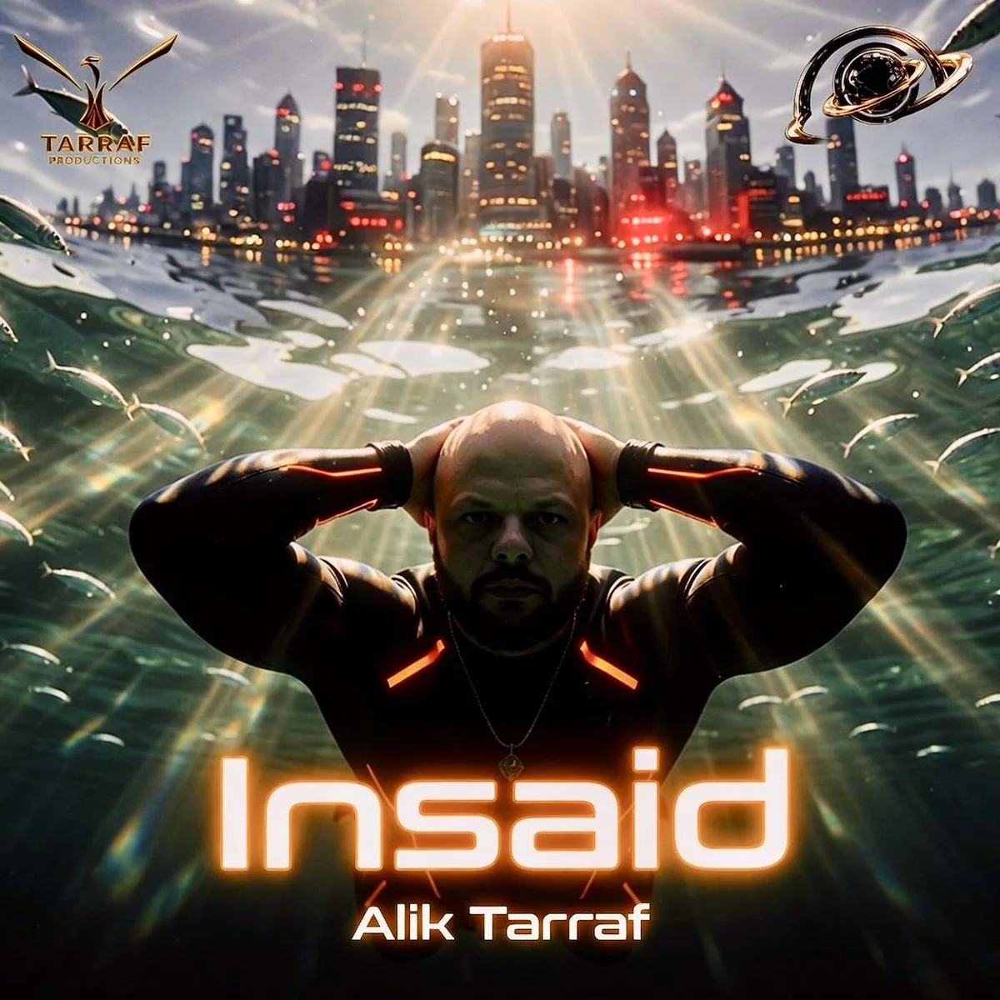
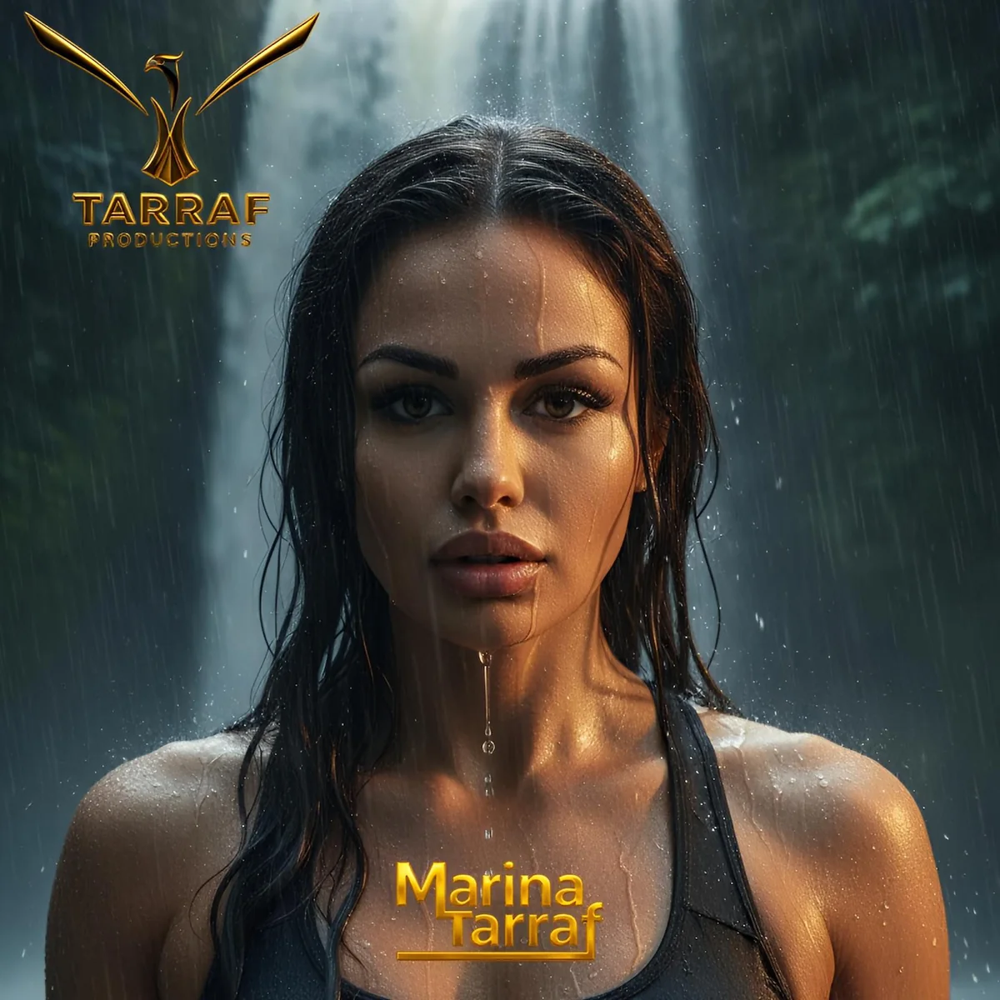
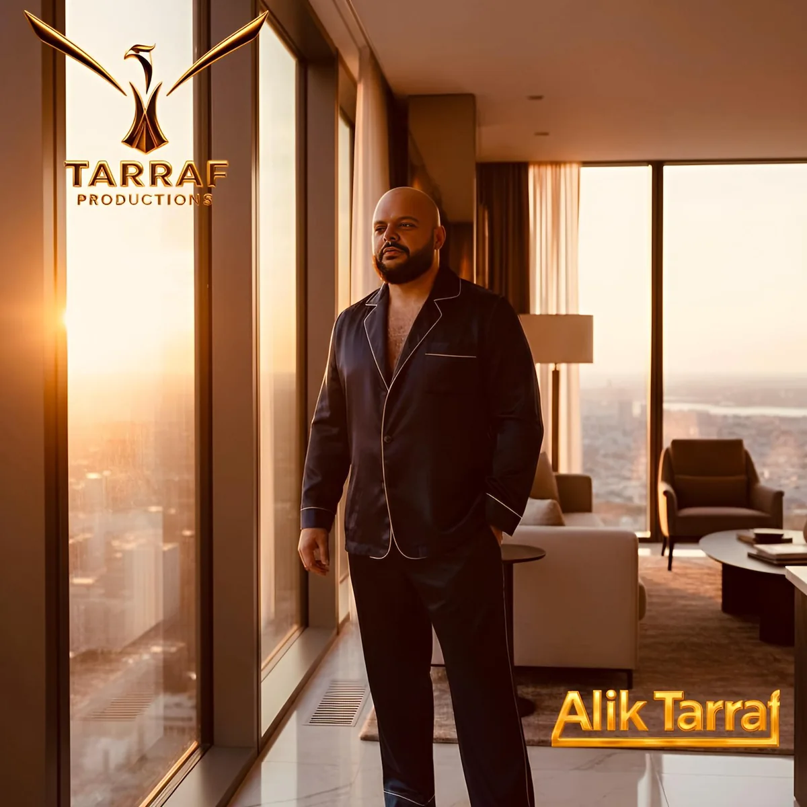
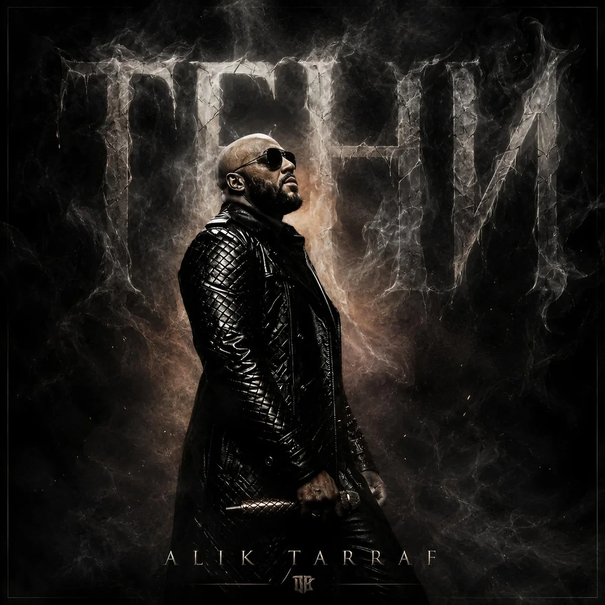
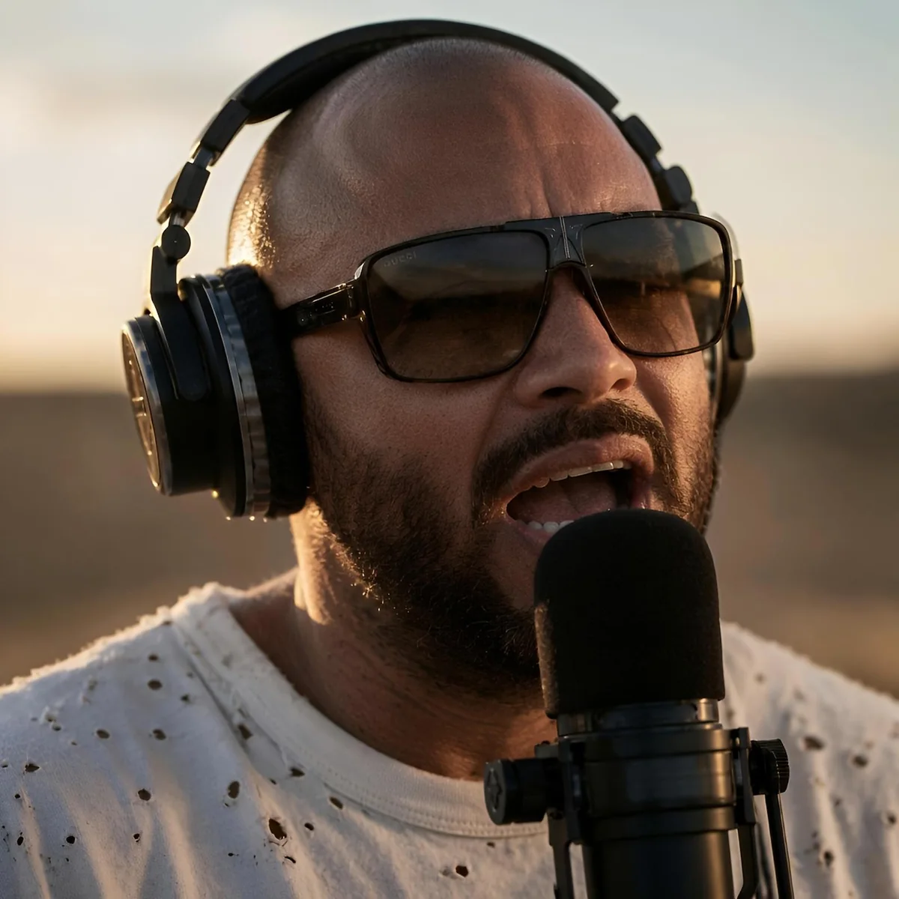
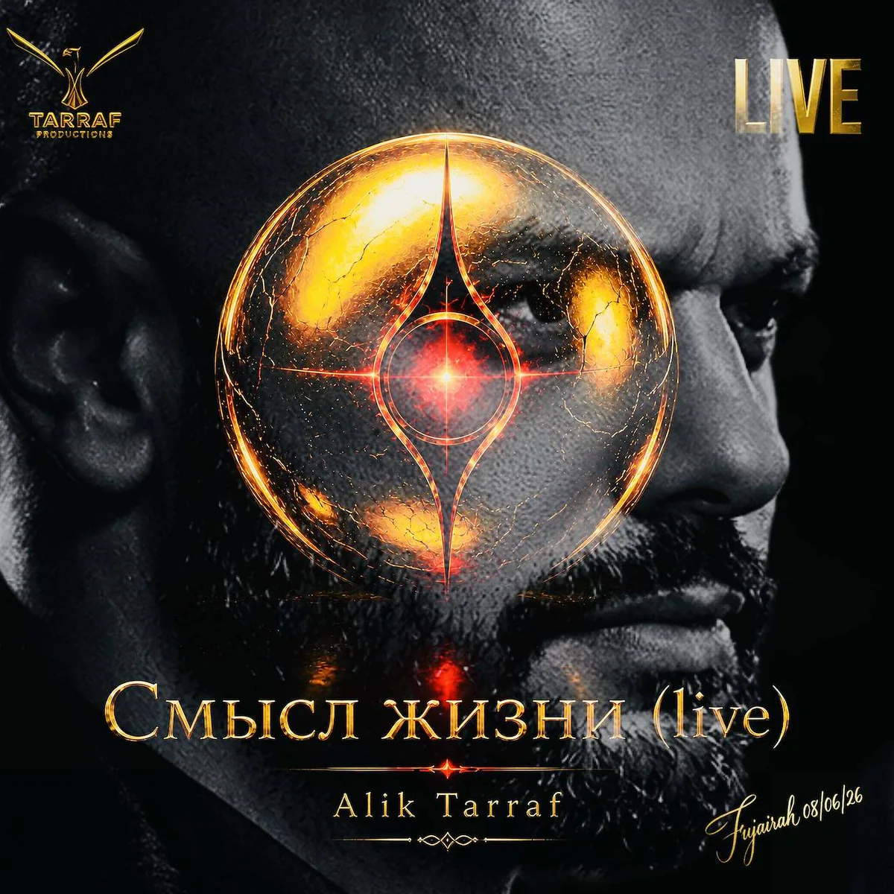

# Обложки: что осталось подтвердить

Проверенные пары уже включены в `assets/covers/release-map.json`. Здесь только нерешённые вопросы. Номер COV относится к исходному архиву, номер SNG — к релизу.

## Релизы без подтверждённой обложки

| ID | Название | UPC |
| --- | --- | --- |
| SNG-015 | PROSTO | 199732931703 |
| SNG-051 | Shtorm i Lyubov | 199737612591 |
| SNG-052 | Sila Lyubvi | 199737598277 |
| SNG-059 | New World | 199739691075 |
| SNG-074 | Ай Одесса | 199741332973 |
| SNG-078 | Смысл Жизни | 199742899222 |
| SNG-092 | ПРОЩАЙ | 199743524048 |
| SNG-093 | ТЕНИ | 199743452464 |
| SNG-108 | Meaning of Life | 199748808495 |
| SNG-158 | КАЧЕЛІ ((UA Version)) | 199946180348 |
| SNG-182 | DICTATOR MODE | 821530772225 |
| SNG-210 | Inside | 825233680368 |
| SNG-240 | Мой путь (LIVE) | 821430004266 |
| SNG-272 | King's move | 821500845171 |

## Картинки для уточнения

Для картинки достаточно указать название релиза или его SNG-ID. Если нужной обложки здесь нет, нужен её исходный файл. Статусы дубликатов приведены отдельно ниже.

| Обложка | Что нужно уточнить |
| --- | --- |
| **COV-046**  | Название песни на обложке не указано: Алик и Марина в белом. |
| **COV-050**  | Название песни не указано: Алик в чёрной куртке, надпись TARRAF PRODUCTIONS. |
| **COV-099**  | Есть пометка VIP LIVE, но название песни не указано. |
| **COV-133**  | На обложке написано Insaid; в реестре есть Inside (SNG-210). Нужно подтвердить соответствие. |
| **COV-170**  | Портрет Марины у водопада; название песни не указано. |
| **COV-171**  | Алик в помещении у окна; название песни не указано. |
| **COV-188**  | Алик и Марина, короны и сценическая композиция; название песни не указано. |
| **COV-211**  | Алик поёт на сцене при фиолетовом свете; название песни не указано. |
| **COV-212**  | Тёмная иллюстрация с медведем; название песни не указано. |
| **COV-228**  | Алик в наушниках у микрофона; название песни не указано. |
| **COV-230**  | На обложке Смысл жизни (live). Требуется подтвердить использование для SNG-078 или отдельного live-релиза. |

## Дубликаты и альтернативные файлы

| Файл | Пояснение |
| --- | --- |
| COV-019 | Побайтовый дубликат COV-018: Жизнь это Ринг (SNG-154). |
| COV-159 | Второй файл обложки Колючий, но родной (SNG-146); основным выбран COV-010. |
| COV-186 | Второй вариант Просто (remix), SNG-028; основным выбран COV-034. Не назначен обычному PROSTO. |
| COV-225 | Второй файл обложки Мама (SNG-102); основным выбран COV-157. |

PROSTO (SNG-015): на проверенной странице Apple Music изображена Марина на оранжевом фоне с надписью «ПРОСТО» без remix. В исходном архиве найденные COV-034 и COV-186 имеют другую композицию и надпись remix; использовать их для SNG-015 без подтверждения нельзя.

Для остальных пар требуется дополнительная сверка с официальной страницей релиза или подтверждение владельца каталога.
